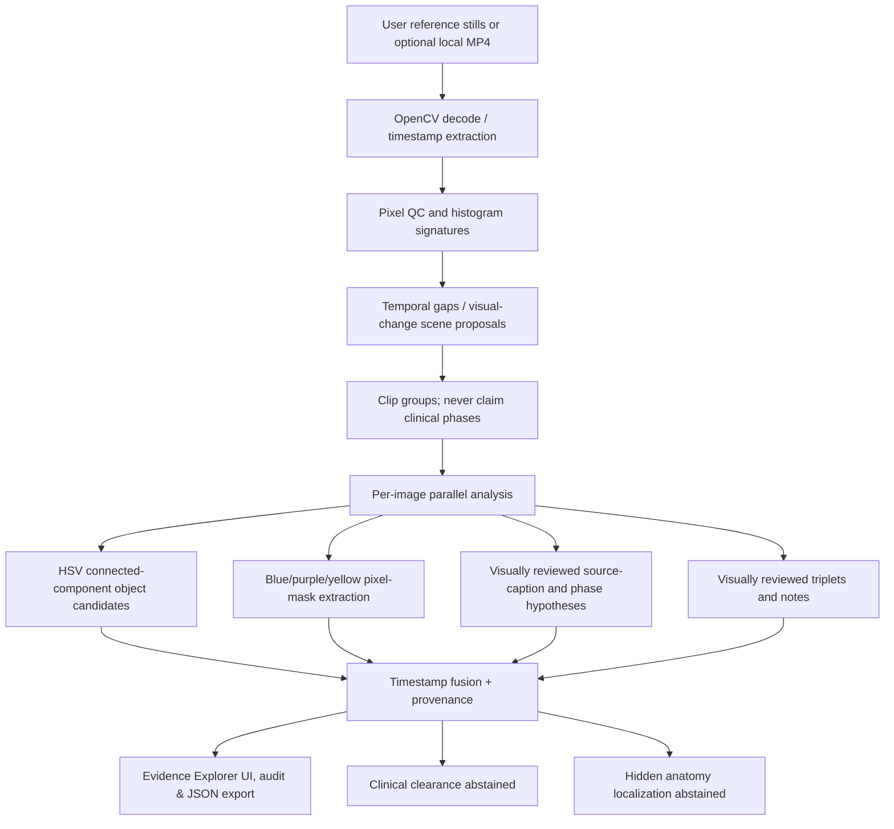

# Architecture & Data Contracts — SafeOR Evidence Explorer

## Executed pipeline

## Frame result contracts

`data/analysis.json`: `frames[].time_ms, image, computed_overlay, qc, segmentation, object_detection, phase, action_triplets, source_caption, review_regions, safety, provenance`. All computed detection boxes are in `%` coordinates, derived from pixel-color regions; human-indexed boxes are always in a separate field.

`segmentation.regions.blue/purple/yellow` contains pixel component counts and coverage, without anatomy semantics. The PNG alpha mask is an image processing artifact; any overlaid contours in the original are still present when the computed mask is toggled off.

`action_triplets[]`: `{subject, predicate, object, source, certainty, time_ms}`. Only available on visually reviewed reference images. Other cases must abstain until a real trained action model is integrated.

`phase`: `{label,status,method,score}`; numeric score is `null`, since nothing is calibrated. Surgical phase is a source-context hypothesis.

`safety`: `{go_zone:false,no_go_zone:null,hidden_anatomy_localized:false,surgical_clearance:'NOT_PROVIDED',clinical_review_required:true}`.

## Roadmap for the *actual surgical AI* version

1. Surgically relevant instrument OD: train/validate detection on a licensed dataset from the target procedure. Report model ID, score calibration, IoU/AP and out-of-distribution failure cases.
2. Semantic and instance anatomy segmentation: load an actual SAM2/MedSAM adapter with clinician-supplied prompts or properly trained class-specific model; evaluate per-structure Dice and boundary metrics on expert annotations.
3. Phase recognition: use full-sequence models with procedure-specific label taxonomy and annotated transitions; avoid inferring phase solely from sparse stills.
4. Action triplets: end-to-end instrument–verb–target video model or specialized triplet head with temporal windows and clinician ground truth; distinguish visually observed contact from inferred surgical intention.
5. Hidden anatomy: only use anatomically justified priors, validated spatial registration and explicit uncertainty. Never display invisible structures as observed pixels.
6. Risk review: clinically developed danger/clearance ontology, error budget, failures/occlusion policy, surgeon approval workflow; prospective multi-site validation before any intraoperative display.
7. Video ingestion: full decoding, shot/change-point detection with temporal context, frame synchronization, video-to-scene graph, drift-resistant tracking, event fusion and provenance.

## Testable requirements

- Same source frames => deterministic PNG masks and image metrics.
- 20 reference timestamps preserved verbatim, sorted.
- Every automatic detection has `method=automated_hsv_and_connected_components`.
- Every source-annotation polygon has `clinical_go_no_go=not_determined`.
- Every frame has `safety.surgical_clearance=NOT_PROVIDED`.
- Neither runtime nor exported report claims clinical GO/NO-GO or hidden-anatomy localization.
- No trained-model output claim without a real model artifact and inference execution.
